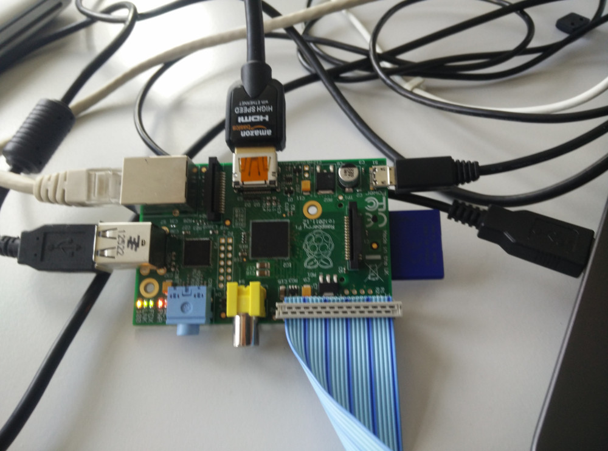

# raspberry-led-strip
NMCT Data Communication project: talking to a LED strip with the Raspberry Pi

# Verslag

## Week 1



Tijdens de eerste week hebben we de Raspberry Pi opgezet en klaargemaakt. We hebben de [Raspbian](http://www.raspbian.org/) image afgehaald van de [downloadpagina](http://www.raspberrypi.org/downloads/). Unzippen en een `sudo dd bs=4M if~/2015-02-16-wheezy-raspbian.img of=/dev/sdc` later stond Raspbian op het SD-kaartje. Voor de eerste boot verbonden we de Raspberry Pi met een scherm (over HDMI) en een toetsenbord. Veel hebben we niet veranderd bij de installatie, behalve dan het expanden van de image zodat het volledige kaartje gebruikt wordt, en het enablen van de SPI en I2C kernel modules.

Na het rebooten staken we een netwerkkabel in. We voegden `allow-hotplug eth0` en `auto eth0` toe aan `/etc/network/interfaces` en restartten de networkingservice met `sudo service networking restart`. Dat zorgt ervoor dat we de netwerkkabel mogen uittrekken naar believen, Raspbian zal proberen opnieuw te verbinden wanneer hij opnieuw wordt ingestoken.

`sudo ifconfig` vertelde ons alles wat we moesten weten: het IP-adres op het lokale netwerk. Even vreesden we dat we door restricties op het schoolnetwerk niet zouden kunnen SSH'en, maar dat bleek wel te lukken. Na deze stap verwijderden we het scherm en toetsenbord van de Raspberry Pi, aangezien ze weinig nut hadden. De volgende les zullen we wel het scherm moeten insteken om het IP-adres te weten te komen; dat wordt immers via DHCP verkregen. Een oplossing is een service zoals [no-ip](http://www.no-ip.com), maar dat zou ons te ver leiden.

### Soorten pinnummering

Na de set-up konden we beginnen. We sloten de LED-strip aan en bogen ons over de cryptische pinouts van de Rapsberry Pi: er zijn blijkbaar verschillende manieren om de pinnen te nummeren: *physical numbering*, *GPIO numbering* en *BCM numbering*.

#### Physical numbering

De fysieke nummering is het gemakkelijkst: de pinnen volgen een normale nummering. Linksonder begint de nummering bij 1, erboven zit 2, de onderste pin van de twee rij is 3 en zo voort. Een synoniem is board numbering.

#### GPIO numbering

GPIO numbering is hoe de computer de pinnen ziet en lijkt volledig willekeurig te zijn.

#### BCM numbering

BCM lijkt hetzelfde te zijn als GPIO-nummering. De naam komt van de BCM2835-chip op de Raspberry Pi, die gebruikt wordt om de GPIO-pinnen aan te sturen ([bron](https://projects.drogon.net/raspberry-pi/wiringpi/pins/))

### WiringPi numbering

[WiringPi](http://wiringpi.com/) is een C-bibliotheek om te interfacen met de GPIO-pinnen. Alsof er nog niet genoeg verwarring was, besloten ze om hun eigen systeem te gebruiken. 

### Keuze

Wij kozen voor de BCM-nummering.

### Ribbon cable pinout

We kregen een bakje met daarin een switch, button en de kerstlichtjes aangesloten. Dit konden we verbinden met de Raspberry Pi door middel van de ribbon cable. Dit is de pinout:

Physical numbering | GPIO/BCM numbering | Component      | LED strip connection
-------------------|--------------------|----------------|---------------------
7                  | 4                  | LED            | 
11                 | 17                 | Schakelaar     | 
12                 | 18                 | Drukknop       | 
15                 | 22                 | Groen          | Clock
16                 | 23                 | Wit            | Data

Voorbeeld van aansturen: de LED in het zwarte doosje is aangesloten op GPIO 4 en physical pin 7. We spreken deze pin aan met BCM-nummering 4.

### Aansturen vanuit Python

We besloten om Python te gebruiken als programmeertaal, vanwege het gemak (we hadden beiden niet veel zin in C) en de goede libraries. Belangrijk is om Python altijd als root te starten (`sudo python` of `sudo python xxx.py`).

#### Inputs

```
import RPi.GPIO as GPIO
GPIO.setmode(GPIO.BCM)        # we maken gebruiken van BCM/GPIO-nummering
GPIO.setup(17, GPIO.IN)       # we gebruiken pin 17 als input
GPIO.input(17)                # we vragen de status op van pin 17 (laag of hoog)
```

#### Outputs

```
import RPi.GPIO as GPIO
GPIO.setmode(GPIO.BCM)        # we maken gebruiken van BCM/GPIO-nummering
GPIO.setmode(4, GPIO.OUT)     # we gebruiken pin 4 als een output
GPIO.output(4, 1)             # zet pin 4 hoog
```

### Aansturen van de LED-strip

## Week 2

Deze week willen we het aansturen van de LEDs goed krijgen. We moeten continu blijven sturen: de eerste byte zet het rood van de eerste LED, de tweede byte het groen van de eeste LED, de derde byte het blauw van de eerste LED, de vierde byte het rood van de tweede LED, enzovoort. Per LED moeten er dus 24 bits (3 bytes) verstuurd worden. Er moet een pauze van meer dan 500us tussen de verschillende dataframes zitten.

## Week 3

## Week 4


